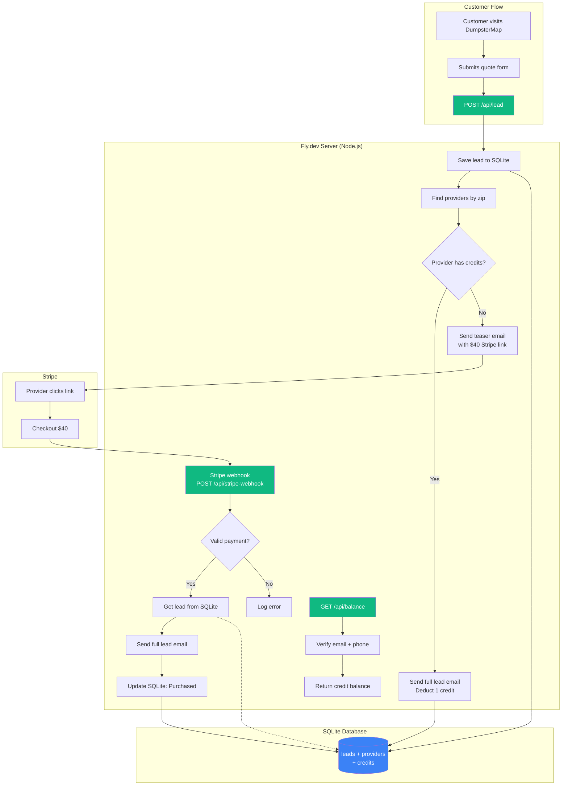

# DumpsterMap.io 🗺️

**Find and compare dumpster rental prices from 13,000+ providers nationwide.**

🌐 **Live:** [dumpstermap.io](https://dumpstermap.io) | [dumpstermap.fly.dev](https://dumpstermap.fly.dev)

## Features

- 🗺️ **Interactive Map** - Browse 8,000+ providers on a dark-themed map with clustering
- 🔍 **Search** - Find providers by ZIP code or city
- ⭐ **Filters** - Filter by rating, review count, sort by relevance
- 📞 **Direct Contact** - Call or visit provider websites instantly
- 📱 **Mobile Responsive** - Works on desktop and mobile
- 💰 **Lead System** - Quote requests with provider credit system

---

## Architecture



**✅ Everything runs on Fly.dev — No external dependencies needed!**

---

## Tech Stack

| Component | Technology |
|-----------|------------|
| **Frontend** | Vanilla HTML/CSS/JS |
| **Backend** | Node.js (Express) |
| **Database** | SQLite (Fly Volume) |
| **Maps** | Leaflet + MarkerCluster |
| **Tiles** | CARTO Dark |
| **Hosting** | Fly.io |
| **Payments** | Stripe |
| **Email** | Resend (or SMTP fallback) |
| **Analytics** | GoatCounter |

---

## API Endpoints

| Endpoint | Method | Purpose |
|----------|--------|---------|
| `/api/lead` | POST | Submit new lead from quote form |
| `/api/stripe-webhook` | POST | Handle Stripe payment events |
| `/api/balance` | GET | Check provider credit balance |

---

## Data

- **13,651 providers** scraped from Google Maps
- **50 states** covered
- **Fields:** name, address, phone, website, rating, reviews, lat/long
- **Source:** OutScraper API (metro-level queries for 8x better coverage)

---

## Local Development

```bash
# Install dependencies
npm install

# Run locally
npm start
# Visit http://localhost:3000

# Or serve static files only
python -m http.server 8080
```

---

## Deploy

```bash
fly deploy
```

### Required Secrets

```bash
# Email: Resend API Key (recommended)
fly secrets set RESEND_API_KEY=re_xxxxxxxxxx

# OR Email: Gmail App Password (fallback)
# fly secrets set SMTP_PASS=xxxx-xxxx-xxxx-xxxx

# Stripe Secret Key
fly secrets set STRIPE_SECRET_KEY=sk_live_xxx

# Stripe Webhook Secret
fly secrets set STRIPE_WEBHOOK_SECRET=whsec_xxx
```

### Email Setup (Resend)

1. Sign up at [resend.com](https://resend.com)
2. Add and verify `dumpstermap.io` domain
3. Get API key from dashboard
4. Set the secret: `fly secrets set RESEND_API_KEY=re_xxx`

### Stripe Webhook URL

```
https://dumpstermap.fly.dev/api/stripe-webhook
```

---

## Project Structure

```
dumpstermap/
├── index.html          # Homepage
├── results.html        # Search results + map
├── provider.html       # Provider detail page
├── calculator.html     # Size calculator
├── sizes.html          # Size guide
├── for-providers.html  # Provider signup/claim
├── app.js              # Frontend JavaScript
├── server.js           # Node.js backend (API routes)
├── data/
│   ├── providers.json  # 8,127 providers (web-ready)
│   ├── raw/            # Raw OutScraper data
│   └── cleaned/        # Cleaned/deduped data
├── dumpster-rental/    # 500+ SEO city landing pages
├── scripts/
│   └── clean_data.py   # Data cleaning pipeline
├── Dockerfile
└── fly.toml
```

---

## Database Schema

```sql
-- Leads table
CREATE TABLE leads (
    id INTEGER PRIMARY KEY AUTOINCREMENT,
    name TEXT NOT NULL,
    email TEXT NOT NULL,
    phone TEXT NOT NULL,
    zip TEXT NOT NULL,
    project_type TEXT,
    provider_id TEXT,
    status TEXT DEFAULT 'pending',
    purchased_by TEXT,
    created_at DATETIME DEFAULT CURRENT_TIMESTAMP
);

-- Provider credits
CREATE TABLE provider_credits (
    id INTEGER PRIMARY KEY AUTOINCREMENT,
    email TEXT UNIQUE NOT NULL,
    phone TEXT,
    credits INTEGER DEFAULT 0,
    updated_at DATETIME DEFAULT CURRENT_TIMESTAMP
);

-- Transactions
CREATE TABLE transactions (
    id INTEGER PRIMARY KEY AUTOINCREMENT,
    provider_email TEXT NOT NULL,
    lead_id INTEGER,
    amount INTEGER,
    type TEXT, -- 'purchase' or 'spend'
    stripe_session_id TEXT,
    created_at DATETIME DEFAULT CURRENT_TIMESTAMP
);
```

---

## SEO Strategy

- Programmatic city landing pages (500+ cities)
- Schema.org LocalBusiness markup
- Metro-focused content for high-intent searches

---

## License

MIT
