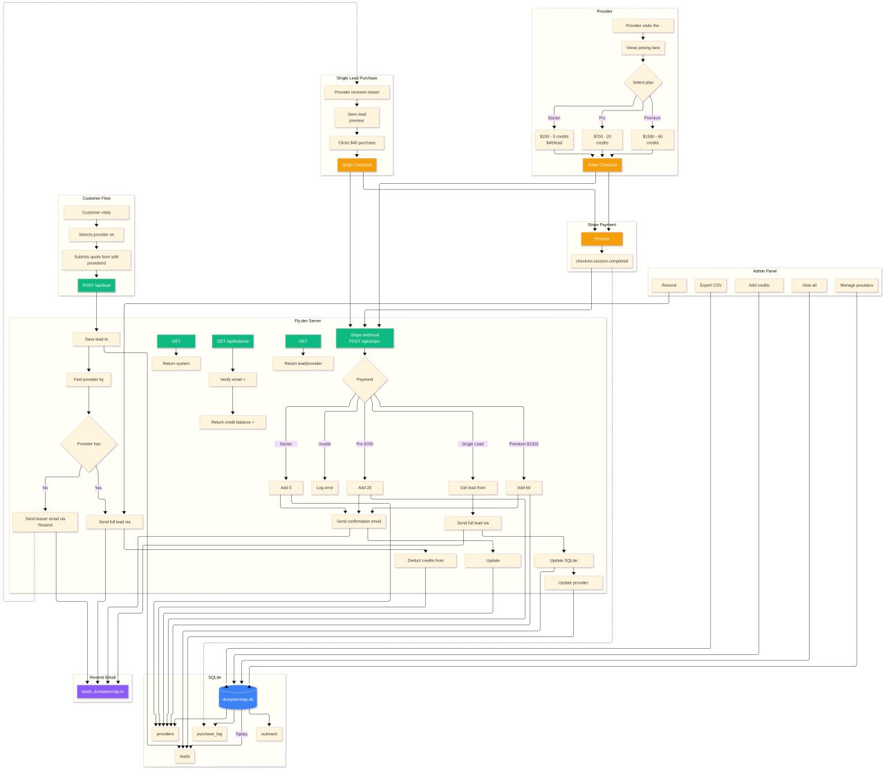

# DumpsterMap.io 🗺️

**Find and compare dumpster rental prices from 13,000+ providers nationwide.**

🌐 **Live:** [dumpstermap.fly.dev](https://dumpstermap.fly.dev) | [dumpstermap.io](https://dumpstermap.io)  
🔧 **Admin:** [/admin](https://dumpstermap.fly.dev/admin?key=dumpstermap2026)

## Features

- 🗺️ **Interactive Map** - Browse 8,000+ providers on a dark-themed map with clustering
- 🔍 **Search** - Find providers by ZIP code or city
- ⭐ **Filters** - Filter by rating, review count, sort by relevance
- 📞 **Direct Contact** - Call or visit provider websites instantly
- 📱 **Mobile Responsive** - Works on desktop and mobile
- 💰 **Lead Generation** - Customers submit quotes, providers pay for leads

## Architecture



<details>
<summary>ASCII Diagram (text version)</summary>

```
┌─────────────────────────────────────────────────────────────────────┐
│                        DumpsterMap.io                               │
├─────────────────────────────────────────────────────────────────────┤
│                                                                     │
│   Customer                Provider                  Admin           │
│      │                       │                        │             │
│      ▼                       ▼                        ▼             │
│   [Quote Form]         [Buy Credits]           [Admin Panel]        │
│      │                       │                        │             │
│      ▼                       ▼                        ▼             │
│   POST /api/lead      Stripe Checkout         /admin?key=xxx        │
│      │                       │                        │             │
│      └───────────┬───────────┘                        │             │
│                  ▼                                    │             │
│         ┌────────────────┐                            │             │
│         │   server.js    │◄───────────────────────────┘             │
│         │  (Express.js)  │                                          │
│         └───────┬────────┘                                          │
│                 │                                                   │
│                 ▼                                                   │
│         ┌────────────────┐     ┌─────────────────┐                  │
│         │    SQLite      │     │  Email (Resend  │                  │
│         │  (Fly Volume)  │     │  or Gmail SMTP) │                  │
│         └────────────────┘     └─────────────────┘                  │
│                                                                     │
│  Tables:                        Email Templates:                    │
│  - leads                        - Full lead (paid)                  │
│  - providers                    - Teaser (unpaid)                   │
│  - purchase_log                 - Credit confirmation               │
│  - credit_transactions          - Admin notifications               │
│  - outreach                                                         │
│  - error_log                                                        │
│                                                                     │
└─────────────────────────────────────────────────────────────────────┘
```
</details>

## Lead Flow

1. **Customer submits quote** → POST /api/lead → Creates lead in SQLite
2. **Match providers** → Find active providers covering that ZIP (or specific provider if direct)
3. **If provider has credits** → Auto-send full contact info, deduct 1 credit
4. **If no credits** → Send teaser email with payment link
5. **Provider pays** → Stripe webhook → Deliver full lead details

## Provider Registration Flow

1. **Provider visits** `/for-providers` → Fills registration form
2. **POST /api/provider/register** → Creates provider record with status "Active"
3. **Redirect to Stripe Checkout** → With `PROVIDER-{id}` as client_reference_id
4. **Payment completed** → Webhook fires with `checkout.session.completed`
5. **Webhook matches provider** by PROVIDER-{id} or email → Adds credits
6. **Confirmation email sent** → Provider ready to receive leads

## Stripe Webhook Detection

The webhook uses multiple methods to detect purchase type (in priority order):
1. **Session metadata** (`pack_type` or `credits` field) - most reliable
2. **Line item product names** (e.g., "Starter Pack", "20 credit")
3. **Original amount before discounts** (`amount_subtotal`)
4. **Final amount with tolerance** (±$5 for Stripe variations)

## Pricing

| Product | Price | Credits |
|---------|-------|---------|
| Single Lead | $40 | 1 |
| Starter Pack | $200 | 5 |
| Pro Pack | $700 | 20 |
| Premium Pack | $1,500 | 60 |

## Tech Stack

- **Backend:** Node.js + Express.js
- **Database:** SQLite (better-sqlite3) on Fly.io volume
- **Email:** Resend API (primary) or Gmail SMTP (fallback)
- **Payments:** Stripe Checkout + Webhooks
- **Frontend:** Vanilla HTML/CSS/JS
- **Maps:** Leaflet + MarkerCluster + CARTO Dark tiles
- **Hosting:** Fly.io

## Testing

```bash
# Run all tests
npm test

# Watch mode (re-run on changes)
npm run test:watch

# With coverage report
npm run test:coverage
```

### Test Results

All tests covering lead flow, payments, credit management, provider matching, and subscriptions:

```
▶ Credit Pack Detection (8 tests)
▶ Provider Matching (7 tests)
▶ Lead Routing Logic (7 tests)
▶ Balance Verification (4 tests)
▶ Payment Idempotency (5 tests)
▶ Credit Management (6 tests)
▶ Email Validation (5 tests)
▶ Lead ID Generation (2 tests)
▶ ZIP Code Validation (2 tests)
▶ Premium Perks Detection (3 tests)
▶ Full Purchase Flow (2 tests)
▶ Subscription Renewals (4 tests)
▶ Premium Expiration (2 tests)
▶ Provider Registration Flow (5 tests)
▶ Provider Activity Metrics (4 tests)
▶ API Provider Management (4 tests)

Tests:       72 passed, 72 total
Duration:    ~200ms
```

## Local Development

```bash
# Install dependencies
npm install

# Run server (requires Node 18+)
node server.js

# Or with auto-reload
npx nodemon server.js

# Visit http://localhost:8080
```

## Environment Variables

```bash
# Email (choose one)
RESEND_API_KEY=re_xxx        # Preferred
SMTP_USER=admin@dumpstermap.io
SMTP_PASS=your-app-password

# Optional
ADMIN_PASSWORD=dumpstermap2026
DATA_DIR=/data  # For Fly.io volume
EMAIL_FROM="DumpsterMap <leads@dumpstermap.io>"
```

## Deploy

```bash
# Deploy to Fly.io
fly deploy

# View logs
fly logs

# SSH into instance
fly ssh console

# Check database
fly ssh console -C "sqlite3 /data/dumpstermap.db '.tables'"
```

## Stripe Webhook Setup

1. Create webhook endpoint in Stripe Dashboard → Developers → Webhooks
2. URL: `https://dumpstermap.fly.dev/api/stripe-webhook`
3. Events: `checkout.session.completed`, `invoice.paid`
4. Copy signing secret and set as `STRIPE_WEBHOOK_SECRET` env var
5. Test with Stripe CLI: `stripe trigger checkout.session.completed`

### Subscription Renewals

The webhook automatically handles `invoice.paid` events for recurring subscriptions:
- Detects renewal (not initial subscription)
- Adds monthly credits (e.g., 3 for Featured Partner)
- Extends premium status by 30 days
- Sends confirmation email
- Logs to purchase_log as `SUB_RENEWAL`

## Stripe Webhook Flow

```
1. WEBHOOK RECEIVED
   ↓
2. VERIFY SIGNATURE (using STRIPE_WEBHOOK_SECRET)
   ↓ (reject if invalid)
3. CHECK EVENT TYPE = 'checkout.session.completed'
   ↓
4. CHECK PAYMENT STATUS = 'paid'
   ↓ (reject if not paid)
5. IDEMPOTENCY CHECK (prevent duplicate processing)
   ↓
6. LOG TO purchase_log (status: 'Processing')
   ↓
7. DETERMINE PURCHASE TYPE:
   ├─ $200 → 5 credits (Starter Pack)
   ├─ $700 → 20 credits (Pro Pack)
   ├─ $1500 → 60 credits (Premium Pack)
   └─ $40 with leadId → Single lead purchase
   ↓
8. UPDATE PROVIDER:
   - credit_balance += credits
   - last_purchase_at = now()
   ↓
9. UPDATE purchase_log (status: 'Credits Added')
   ↓
10. SEND CONFIRMATION EMAIL
   ↓
11. NOTIFY ADMIN
```

## API Endpoints

| Endpoint | Method | Description |
|----------|--------|-------------|
| `/api/lead` | POST | Submit new lead |
| `/api/stripe-webhook` | POST | Stripe payment webhook (idempotent) |
| `/api/balance` | GET | Check provider credit balance |
| `/api/provider` | GET | Provider profile lookup |
| `/api/provider/zips` | POST | Provider self-service zip update |
| `/api/stats` | GET | Public stats (leads, providers) |
| `/api/admin/stats` | GET | Admin stats (revenue, errors) - requires key |
| `/api/admin/daily-summary` | GET | Daily metrics summary for monitoring - requires key |
| `/api/admin/zip-coverage` | GET | ZIP coverage analysis (providers per zip, gaps) - requires key |
| `/api/admin/send-test-lead` | POST | Send test lead to provider for verification - requires key |
| `/api/admin/pricing` | GET | View credit pack pricing config and Stripe product mappings - requires key |
| `/api/admin/credit-history` | GET | View credit transaction audit trail (?provider_id=X&type=X&limit=100) - requires key |
| `/api/admin/errors` | GET | View recent errors (?hours=24&limit=50) - requires key |
| `/api/admin/errors/cleanup` | POST | Delete errors older than 7 days - requires key |
| `/api/admin/maintenance` | POST | Run all cleanup tasks (premium expiration, log cleanup, reminders) - requires key |
| `/api/admin/provider/:id` | GET | Get detailed provider info by ID - requires key |
| `/api/admin/provider/:id` | PUT | Update provider fields programmatically - requires key |
| `/api/admin/provider/:id/credits` | POST | Add/deduct credits for provider (with audit log) - requires key |
| `/api/admin/premium-status` | GET | View premium/verified providers - requires key |
| `/api/admin/test-webhook` | POST | Test webhook detection (dev only) - requires key |
| `/api/admin/webhook-log` | GET | View recent webhook events - requires key |
| `/api/admin/registration-funnel` | GET | Registration-to-purchase funnel stats - requires key |
| `/api/admin/bulk-add-credits` | POST | Add credits to multiple providers at once - requires key |
| `/api/admin/batch-email` | POST | Send batch email to providers (dryRun supported) - requires key |
| `/api/admin/subscriptions` | GET | View subscription stats (MRR, active, expiring) - requires key |
| `/api/admin/health-check` | GET | Cron-friendly health check with alerts - requires key |
| `/api/admin/send-zip-reminders` | POST | Send reminder emails to providers with credits but no ZIPs - requires key |
| `/api/admin/search-providers` | GET | Quick provider search (?q=term) - requires key |
| `/api/admin/provider/:id/leads` | GET | Get all leads for a specific provider - requires key |
| `/api/admin/weekly-summary` | GET | Weekly stats with trends (?weeks=4) - requires key |
| `/api/admin/provider-activity` | GET | Provider performance metrics (top performers, inactive, new) - requires key |
| `/admin/export/credit-history` | GET | Export credit transaction history as CSV - requires key |
| `/api/health` | GET | Health check |
| `/admin` | GET | Admin dashboard |
| `/admin/outreach` | GET | Provider outreach tracking |
| `/admin/logs` | GET | System & error logs with revenue breakdown |
| `/admin/export/:type` | GET | Export CSV (leads/providers/purchases/outreach) |

## Project Structure

```
dumpstermap/
├── server.js           # Express backend (leads, payments, admin)
├── index.html          # Main map interface
├── calculator.html     # Size/price calculator
├── results.html        # Search results page
├── quote-form.html     # Lead capture form
├── for-providers.html  # Provider signup page
├── balance.html        # Credit balance checker
├── app.js              # Shared frontend JavaScript
├── data/
│   └── providers.json  # Static provider data for map
├── Dockerfile
├── fly.toml
└── package.json
```

## Admin Features

- **Dashboard** - Stats, leads, providers overview
- **Provider Management** - Add/edit/delete providers, set service zips
- **Credit Management** - Manual credit additions with audit log
- **Outreach Tracking** - Track email campaigns to recruit providers
- **System Logs** - Purchase history and error logs
- **CSV Export** - Export all data types

## Operations & Maintenance

### Daily Maintenance (automatic)
The server runs automatic maintenance every 24 hours:
- Expires premium status for providers past 30-day window
- Sends reminder emails 7 and 3 days before premium expiration

### Manual Maintenance
```bash
# Run all maintenance tasks
curl -X POST "https://dumpstermap.fly.dev/api/admin/maintenance?key=YOUR_KEY"

# Tasks included:
# - Premium expiration check
# - Error log cleanup (>7 days)
# - Webhook log cleanup (>7 days)
# - Premium reminder emails
# - Provider ZIP audit (credits but no service areas)
```

### Monitoring Endpoints
```bash
# Health check (public)
curl https://dumpstermap.fly.dev/api/health

# Health check with alerts (cron-friendly, requires auth)
curl "https://dumpstermap.fly.dev/api/admin/health-check?key=YOUR_KEY"
# Returns: { status: "healthy"|"warning"|"critical", alerts: [...], metrics: {...} }

# Daily summary (leads, revenue, errors)
curl "https://dumpstermap.fly.dev/api/admin/daily-summary?key=YOUR_KEY"

# Subscription stats (MRR, expiring soon)
curl "https://dumpstermap.fly.dev/api/admin/subscriptions?key=YOUR_KEY"

# Error log (last 24h)
curl "https://dumpstermap.fly.dev/api/admin/errors?key=YOUR_KEY"

# ZIP coverage analysis
curl "https://dumpstermap.fly.dev/api/admin/zip-coverage?key=YOUR_KEY"
```

### Daily Health Check Script
```bash
# Run manually or add to cron (9 AM daily)
./scripts/daily-check.sh

# Or via cron:
0 9 * * * cd /path/to/dumpstermap && ./scripts/daily-check.sh >> /var/log/dumpstermap-check.log 2>&1
```

### Testing
```bash
# Test webhook detection logic (doesn't process)
curl -X POST "https://dumpstermap.fly.dev/api/admin/test-webhook?key=YOUR_KEY" \
  -H "Content-Type: application/json" \
  -d '{"amount": 200, "email": "test@example.com"}'

# Send test lead to provider
curl -X POST "https://dumpstermap.fly.dev/api/admin/send-test-lead?key=YOUR_KEY" \
  -H "Content-Type: application/json" \
  -d '{"provider_id": 1, "zip": "34102"}'
```

## License

MIT
